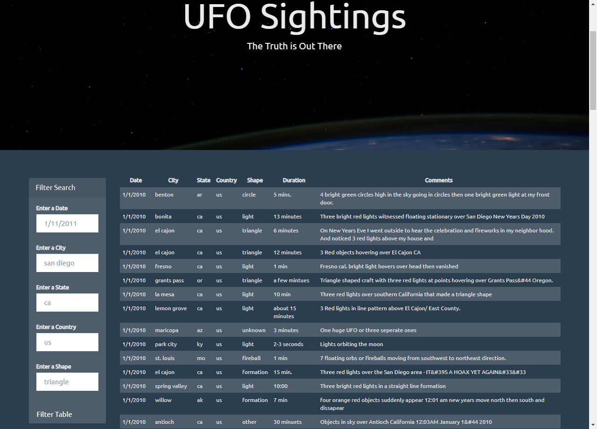
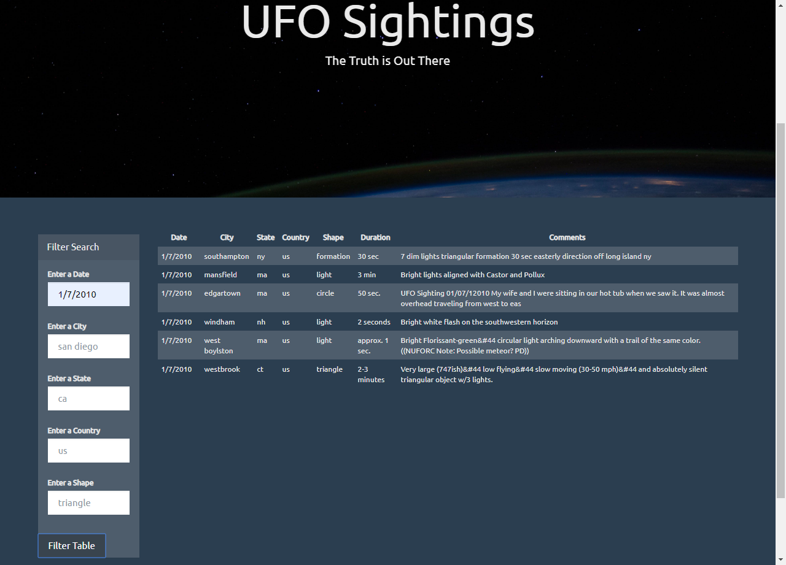
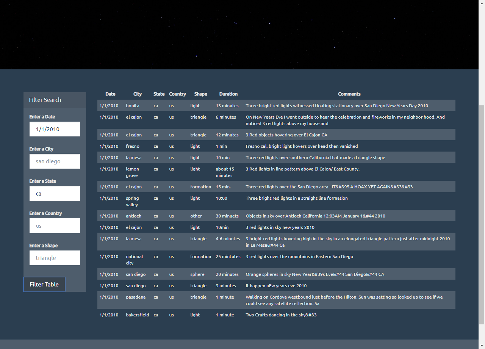
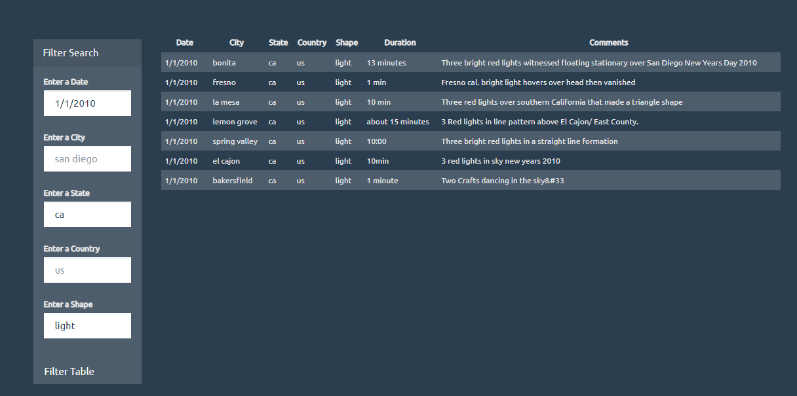
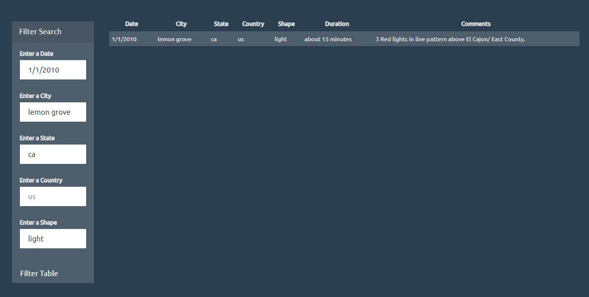
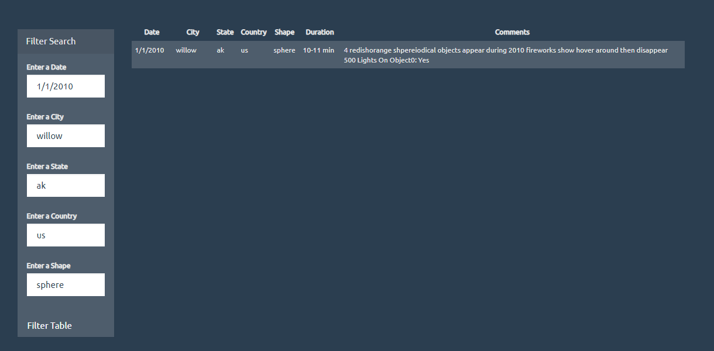

# Project Background
Write code that will create a table dynamically based upon a dataset we provide. We also need to allow our users to filter the table data for specific values. There's a catch though... we only use pure JavaScript, HTML, and CSS, and D3.js on our web pages. They are the only coding languages which can be trusted.

### Level 1: Automatic Table and Date Search

1. Create a basic HTML web page or use the index.html file provided.

2. Using the UFO dataset provided in the form of an array of JavaScript objects, write code that appends a table to your web page and then adds new rows of data for each UFO sighting.

3. Make sure you have a column for date/time, city, state, country, shape, and comment at the very least.

4. Use a date form in your HTML document and write JavaScript code that will listen for events and search through the date/time column to find rows that match user input.

### Level 2: Multiple Search Categories

Complete all of Level 1 criteria.

Using multiple input tags and/or select dropdowns, write JavaScript code so the user can to set multiple filters and search for UFO sightings using the following criteria based on the table columns:

1. date/time
2. city
3. state
4. country
5. shape

### This repo contains:
* index.html
* static folder
  * css folder
    * style.css
  * images folder for images used on webpage
    * nasa.jpg
    * ufo.svg
  * js folder
    * app.js
    * data.js
* screenshots folder
  * 5 screenshots of webpage used in readme

## Screenshots

Webpage with table data loaded and filter fields

Webpage with table filtered by date

Webpage with table filtered by 2 inputs (date, state)

Webpage with table filtered by 3 inputs (date, state, shape)

Webpage with table filtered by 4 inputs (date, city, state, shape)

Webpage with table filtered by 5 inputs (date, city, state, country, shape)

